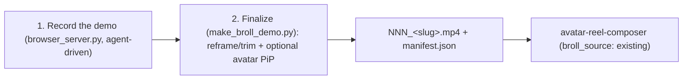

# broll-browser-recorder

Produce the **base layer** of a technical reel from a **live browser demo**: drive
a real browser, record a smooth continuous video of the product being used, then
reframe/trim it for a vertical reel and (optionally) composite a talking avatar in
a PiP corner that narrates what's on screen.

Two-layer architecture (see the scene types in `brand-content-strategy`):

```
broll-browser-recorder (recorded product demo)   ← BASE layer (the proof: real usage)
        +
talking avatar in PiP                              ← OVERLAY layer (narrates the demo)
```

This is the **record-first** sibling of the (planned) "narrate an existing Loom"
idea: instead of narrating a pre-existing video, we **record the demo ourselves**,
then the avatar talks about it. Because the recording is fixed and is the hero, the
PiP is **base-driven** — the demo sets the length and the avatar freezes on its
last frame once its narration ends (see [Avatar PiP](#avatar-pip-overlay---avatar)).

vs [`broll-web-capture`](../broll-web-capture/SKILL.md): that skill animates a
*still* (Ken Burns / scroll) for a quick proof shot; use **this** skill when the
value is the *interaction* — a real click-through, form fill, AI chat, or
multi-step flow.

## When to use

- "Record a demo of this web app / dashboard / flow and make it a reel."
- "Show me clicking through the product with a presenter narrating in the corner."
- "Turn this browser walkthrough into 9:16 B-roll for `avatar-reel-composer`."

## Setup

```bash
pip3 install -r .cursor/skills/broll-core/scripts/requirements.txt
pip3 install -r .cursor/skills/broll-browser-recorder/scripts/requirements.txt
playwright install chromium
```

Requires the **`broll-core`** skill alongside this one (shared geometry + the PiP
compositor, imported via a `sys.path` shim). `ffmpeg` + `ffprobe` must be on PATH
(libx264). No API keys — this skill is fully local.

## Workflow



The order matters: **record the demo first**, then (if using an avatar) author the
narration to describe what the recording shows, generate the avatar clip, and
composite it base-driven.

### 1. Record the demo

Recording is interactive and agent-driven through the Playwright HTTP server
(`browser_server.py`). Prefer the two-phase **practice-then-record** loop for clean
results; for simple flows, record directly. Full API + tips in
[REFERENCE.md](REFERENCE.md).

```bash
S=.cursor/skills/broll-browser-recorder/scripts

# (optional) Phase 1 — practice: learn selectors, timing, network patterns
python3 $S/browser_server.py https://app.example.com \
  --no-record --viewport 1440x900 -o /tmp/practice/ --port 9222 \
  --chrome --clean --cache-name my-demo
# interact fully, then: curl -s -X POST http://localhost:9222/stop  (writes playbook.json)

# Phase 2 — record cleanly (background this process; wait for "READY")
python3 $S/browser_server.py https://app.example.com \
  --viewport 1440x900 -o /tmp/rec/ --port 9222 --chrome --clean --wait 4
```

Then drive the browser adaptively (snapshot → act → wait-for-response → verify),
chaining `curl` calls against `http://localhost:9222`:

```bash
curl -s http://localhost:9222/snapshot                       # see page + element refs
curl -s -X POST http://localhost:9222/action \
  -H 'Content-Type: application/json' \
  -d '{"action":"click","selector":".cta"}'                  # every response returns a fresh snapshot
curl -s -X POST http://localhost:9222/stop                   # saves recording.webm + manifest.json
```

`/stop` returns `{"video": ".../recording.webm", "video_offset": ..., "manifest": ".../manifest.json"}`.
The `manifest.json` (the action log) is what powers the **auto-camera** reframe in
step 2 — keep the video and manifest together.

### 2. Finalize (reframe + optional avatar PiP)

`make_broll_demo.py` post-processes the recording (delegates to `process_video.py`)
and emits a numbered clip + a `manifest.json` drop-in for `avatar-reel-composer`.

```bash
S=.cursor/skills/broll-browser-recorder/scripts

# Base demo only — reframed to 9:16 (auto-camera follows the recorded interactions)
python3 $S/make_broll_demo.py /tmp/rec/ --max-duration 30

# Base demo + avatar PiP narrating it (base-driven: the demo sets the length)
python3 $S/make_broll_demo.py /tmp/rec/ --max-duration 30 \
  --avatar avatares/lolo/pip/scene01.mp4 --corner br
```

Pass either the recording directory (it finds the `.webm` + sibling `manifest.json`)
or the `.webm` path directly. Output lands in `--out-dir` (default `broll_demo/`).

When the recording aspect differs from the target (e.g. a 1440x900 capture → 9:16)
and a `manifest.json` sits next to the video, **auto-camera** generates a lazy
pan/zoom that follows the interactions and blurs the page chrome above them. Tune
with `--max-duration`/`--speed`, or override framing with `--crop` / `--zoom`
(`--no-auto-camera`). See [REFERENCE.md](REFERENCE.md) for auto-camera details.

## Avatar PiP overlay (`--avatar`)

The avatar narrates the demo, so it's composited **base-driven** (`--length base`,
the default here): the recorded demo plays through at its own length and the avatar
sits in the corner. When the narration ends before the demo does, the avatar
**freezes on its last frame** (never restarts talking) and its audio is padded with
trailing silence. Use `--length avatar` only for a short snippet where you want the
narration to drive the length and the demo to be looped under it.

- `--layout pip-circle` (default): avatar masked into a corner circle over the
  near-full demo — best when the demo is the value. `--corner br|bl|tr|tl` (default `br`).
- `--layout split`: demo on top, avatar on the bottom — when the avatar's gestures
  matter more.
- `--face-bias 0..1` (default `0.4`): vertical crop of the circle; lower keeps more
  of the **top (the face)**.

### Length alignment (author narration to the demo)

Because the narration describes the demo, aim for **demo length ≈ narration
length**:

1. Finalize the base demo first and note its duration (or set it with
   `--max-duration` / `--speed`).
2. Author the narration to that runtime, then generate the avatar clip.
3. Composite with `--avatar` (base-driven). Small mismatches are fine — a short
   narration freezes the avatar for the tail; if the narration must run longer,
   slow the demo (lower `--speed` / higher `--max-duration`) so the base covers it.

### Material the avatar clip needs (READ THIS)

Same requirements as every `broll-*` PiP overlay:

1. **Face-focused, locked avatar clip.** The circle is small and must read as a
   face. Generate a **dedicated** shot with
   [`avatar-camera-angles`](../avatar-camera-angles/SKILL.md) using the **`pip`**
   move at `1:1`, then lip-sync it **locked** with
   [`avatar-talking-video`](../avatar-talking-video/SKILL.md) (`p-video-avatar`,
   `--video-prompt "The person is talking, head still, no camera movement"`). This
   compositor never moves the avatar — any drift inside the circle comes from the
   source clip, so keep it locked.
2. **No burned-in subtitles in the avatar clip.** Captions go on the whole reel
   frame in `avatar-reel-composer`'s finishing pass, not inside the PiP.
3. **Matte for a clean cut-out (recommended).** Run the avatar through
   [`video-bg-replace`](../video-bg-replace/SKILL.md) for a transparent clip so only
   the person shows in the circle.
4. **Audio.** The avatar clip carries the narration; the demo (base) is silent
   (screen recordings have no audio) and sets the length.

## Integration with avatar-reel-composer

Each clip is a drop-in B-roll scene. In the storyboard:

```json
{ "id": "s2", "type": "broll", "broll_source": "existing",
  "broll_clip": "broll_demo/001_app-example.mp4", "text": "..." }
```

The composer loops/pads it to the narration slot. For a base + avatar shot, generate
it here with `--avatar` (base-driven) and reference the final clip the same way.
**Subtitles belong to the reel, not the clip** — don't burn captions here or into
the avatar.

## Key options (`make_broll_demo.py`)

| Flag | Default | Notes |
|---|---|---|
| `recording` | (required) | recording `.webm`/`.mp4` or the recording directory |
| `--aspect` | `9:16` | final geometry (`9:16\|16:9\|1:1\|4:5`) |
| `--preset` | – | social preset (`reel`, `post`, …) — overrides `--aspect` geometry |
| `--max-duration` | – | target max seconds; auto-calculates speed |
| `--speed` | `1.0` | playback speed multiplier |
| `--crop` / `--zoom` | – | manual framing (else auto-camera / fit) |
| `--no-auto-camera` | off | disable the manifest-driven reframe |
| `--avatar PATH` | – | composite avatar PiP (locked, face-forward `pip` clip) |
| `--layout / --corner` | `pip-circle` / `br` | PiP placement |
| `--face-bias` | `0.4` | vertical crop of the PiP circle (lower keeps the face) |
| `--length` | `base` | `base` (demo drives length) or `avatar` (narration drives) |
| `--out-dir` / `--slug` | `broll_demo/` / from filename | output location + filename |

## Notes

- The recorder (`browser_server.py`), the post-processor (`process_video.py`) and
  the auto-camera (`auto_camera.py`) are the same tools documented in full in
  [REFERENCE.md](REFERENCE.md) (server API, action types, presets, zoom keyframes,
  playbooks, auto-camera).
- Base demo recordings are **silent**; all audio comes from the avatar layer.
- Never programmatically dismiss popups during recording — interact naturally, as a
  user would.
```
