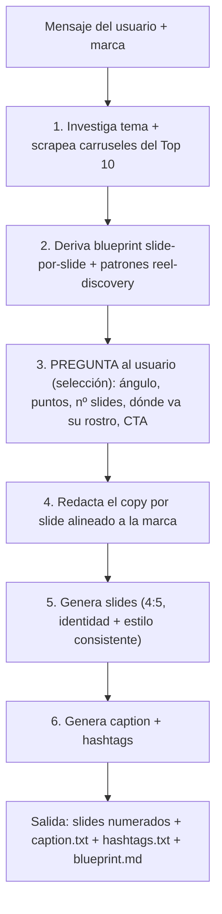

# Carousel Generator (winning structure → on-brand carousel)

Turn a topic + a brand into a finished Instagram carousel: **investigate** what
carousels the competition is winning with, **decompose** the winning structure,
**confirm the angle with the user**, then **generate** the slides, caption and
hashtags — all on-brand and visually consistent.

Built on top of two skills **bundled in this repo** (credentials are reused,
nothing new to configure):
- Image generation → [`asset-generator`](../asset-generator/SKILL.md) (Gemini 3 Pro Image, key from its `config.json`).
- Apify token + scraping patterns → [`reel-discovery`](../reel-discovery/SKILL.md) (token from its `config.json`).

## When to use

- "Create an Instagram carousel about <topic> for <brand>."
- "What carousels is <competitor / niche> winning with? Copy that structure."
- "Turn this idea into a branded carousel with caption and hashtags."

## Setup (one-time)

```bash
pip3 install -r .cursor/skills/carousel-generator/scripts/requirements.txt
```

Credentials are auto-resolved (no setup needed if the sibling skills are configured):
- Gemini key ← `GEMINI_API_KEY` env → this skill's `config.json` → `asset-generator/config.json`.
- Apify token ← `APIFY_TOKEN` env → this skill's `config.json` → `reel-discovery/config.json`.

To store them in this skill directly (optional):

```bash
python3 .cursor/skills/carousel-generator/scripts/setup_key.py --show   # what's resolved
python3 .cursor/skills/carousel-generator/scripts/setup_key.py \
  --gemini-api-key AIza... --apify-token apify_api_...
```

## The flow (follow in order)



### Step 1 — Research the winning carousels

Scrape the competitor Top-10 (or any handle list), separate carousels vs reels,
prove which format wins, rank the best carousels and download every slide.

```bash
python3 .cursor/skills/carousel-generator/scripts/research_carousels.py \
  --handles sanandoatuex_,leoquins,doctoraflorez \
  --per-profile 12 --top 6 --out-dir runs/rupturas
```

Omitting `--handles` uses the built-in Top-10 default. Read `runs/rupturas/summary.md`
for the carousel-vs-reel evidence and the ranked winners.

### Step 2 — Derive the blueprint

Gemini vision reads the downloaded slides and labels each one
(portada/idea/cita/dato/recap/cta), the hook technique and caption structure;
it fuses this with the reel-discovery narrative patterns. Falls back to a
heuristic blueprint if vision is unavailable.

```bash
python3 .cursor/skills/carousel-generator/scripts/analyze_structure.py \
  --run-dir runs/rupturas --max 4
```

Produces `runs/rupturas/blueprint.md` (the molde to replicate).

### Step 3 — Confirm with the user (REQUIRED, interactive)

Before writing any copy, **use the AskQuestion tool** to ratify the direction.
Do not skip this. Present sensible defaults derived from the blueprint and let
the user adjust:

- **Ángulo / patrón narrativo** (listicle P1, contrarian P2, lectura de mente P3, pregunta P4, how-to P5).
- **Puntos clave** (los ítems/ideas que irán en las slides).
- **Nº de slides** (por defecto el `typical_slide_count` del blueprint).
- **Dónde aparece su rostro** (portada, cierre, ambos, o ninguno).
- **CTA** (guardar / comentar / seguir / enlace).

### Step 4 — Write the slide plan

Turn the confirmed answers into a `plan.json` (schema in `REFERENCE.md`, sample in
[`examples/plan.example.json`](examples/plan.example.json)): one entry per slide with
`role`, `headline`, `body`, `show_face`, `style`, plus an optional `caption` and
`hashtags`. Keep copy on-brand (tone from the brand profile) and one idea per slide.

For hashtags, build a ranked set from the winners:

```bash
python3 .cursor/skills/carousel-generator/scripts/research_hashtags.py \
  --run-dir runs/rupturas --seed superartuex --limit 25
```

### Step 5 — Generate the carousel

```bash
python3 .cursor/skills/carousel-generator/scripts/generate_carousel.py \
  --plan plan.json --brand arnoldo --out-dir out/mi-carrusel
```

- `--brand` is a name in `brands/` (e.g. `arnoldo`) or a path to a brand JSON.
- The cover (slide 1) is generated first and passed as a style reference to the
  rest so every slide looks like one coherent set.
- Add `--dry-run` to review the exact per-slide prompts before spending credits.

Output in `out/mi-carrusel/`: `slide_01.png … slide_NN.png`, `caption.txt`,
`hashtags.txt`, `plan.used.json`.

## Brands

Reusable profiles live in `brands/`. Copy `brands/_template.json` for a new
brand (palette, fonts, tone, language, default slide count, logo + identity
photos). `brands/arnoldo.json` is preconfigured for the ruptures/grief niche.
To use a real face, add photo paths to `assets.identity_photos` and set
`show_face: true` on the relevant slides.

## Notes

- Carousels are downloaded as sidecars (all child images) via the Apify IG actor.
- Visual consistency: brand assets + slide-1 reference are fed to `--ref`.
- Everything is Spanish-first by default (the niche is Spanish-speaking).
- Generated slides and `runs/` are media, so they are git-ignored by the repo.

See [`REFERENCE.md`](REFERENCE.md) for the plan schema, brand schema, slide styles and troubleshooting.
