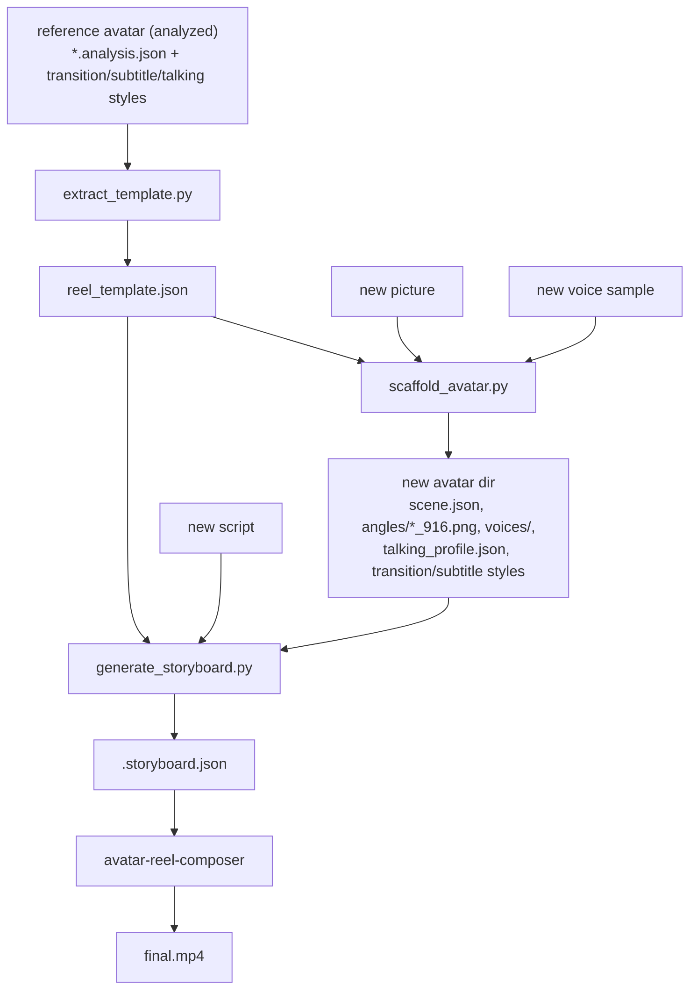

# reel-restyle -- reference

Internals of the cross-avatar reel style-transfer skill: the `reel_template.json`
schema, the camera-angle mapping, the scaffold stage machine, and the
storyboard contract.

## Design

The insight: `video-scene-analysis` already extracts everything that defines a
reel's *style* -- per-scene `scene_type` (talking-head vs B-roll), `camera.angle`
+ `camera.framing`, `zoom_from_previous` (cut/zoom transitions), `audio`
(SFX/music), `start/end/duration`, and `summary.focus`. The avatar also carries
measured `transition_style.json` and `subtitle_style.json`. reel-restyle distills
those into a **script-agnostic template**, then re-applies it to a new avatar.

**Timing model: structural, not beat-locked.** A reference reel's scene
durations belong to *its* narration. A new script has a different length and
rhythm, so durations are never copied. The template keeps the *structure* (beat
count, type sequence, per-beat angle/motion/emphasis) and *proportional pacing*
(`dur_weight` per beat); `avatar-reel-composer` derives the real durations from
the new narration's word-level alignment, consistent with its single-master-
narration + hard-cut pipeline. This is the only model compatible with that
pipeline and was the chosen behavior for this skill.

## Scripts

| Script | Role |
|---|---|
| `extract_template.py` | Reference `*.analysis.json` (+ style files) -> `reel_template.json` |
| `_angle_map.py` | analysis `camera.angle` slug -> `avatar-camera-angles` move |
| `scaffold_avatar.py` | picture + voice + template -> ready new avatar (idempotent stages) |
| `generate_storyboard.py` | template + script -> composer `storyboard.json` (auto-draft + agent refine) |
| `apply_template.py` | Orchestrates scaffold -> storyboard -> compose, with checkpoints |
| `_restyle_common.py` | Sibling-skill path resolution + JSON / subprocess helpers |

## `reel_template.json` schema

See [examples/reel_template.example.json](examples/reel_template.example.json)
for a complete, hand-tuned ~30s / 7-beat example.

| Field | Meaning |
|---|---|
| `source` | Where it came from: `avatar`, `primary_analysis` (defines the beat structure), `analyses[]`, and paths to `transition_style` / `subtitle_style` / `talking_profile` |
| `summary` | `total_scenes`, `talking_head`, `broll`, `total_duration`, `avg_scene_dur`, `cut_rhythm` (fast/medium/slow), `narrative_arc` (per-beat role) |
| `angles_needed` | De-duplicated `avatar-camera-angles` moves to generate for the new avatar |
| `beats[]` | Per scene (see below) |
| `transitions` | Embedded copy of `transition_style.json` (or a `golden_flash` default) |
| `sfx` | `density_sec` (measured) + `events` (`whoosh_before_broll`, `boom_on_emphasis`) |
| `captions` | `style_from` source path + an embedded `subtitle_style` copy |
| `music` | `mood`, `include`, `prompt_hint` (tailor per reel), `words_per_caption` |
| `delivery_style_seed` | Reference mannerisms/delivery STYLE to seed the new `talking_profile` (NOT identity) |

### `beats[]`

| Field | Applies | Meaning |
|---|---|---|
| `index`, `role`, `type` | all | order; `hook`/`body`/`cta`/`close`; `talking_head`/`broll` |
| `dur_weight` | all | scene duration / total -- proportional pacing guide for the split |
| `zoom_from_previous` | all | analysis cut vocabulary (`none`/`zoom_in`/`zoom_out`/`hard_cut`) -> composer motion |
| `emphasis` | all | key beat (zoom-in or tight framing) -> medium-intensity motion |
| `has_sfx`, `audio_profile`, `focus` | all | informational; `focus` seeds B-roll hints |
| `camera_angle`, `framing`, `move` | talking_head | analysis angle + framing; `move` is the mapped `avatar-camera-angles` still |
| `broll_camera`, `broll_hint` | broll | suggested camera move; topic hint (content must be re-authored) |

The beat structure comes from a **single** representative reel (`--primary`,
else the analysis with the richest enrichment / most scenes / longest duration).
Pick a tight reel-length reference (~7-9 beats for a 30s reel); a long-form video
yields many short beats and over-fragments a short script.

## Camera-angle mapping (`_angle_map.py`)

| analysis `camera.angle` | `avatar-camera-angles` move |
|---|---|
| `eye_level` | `eye_level` |
| `low_angle` / `low_angle_v2` | `low_angle` |
| `high_angle` | `high_angle` |
| `three_quarter` | `three_quarter` |
| `dutch_tilt` | `dutch_tilt` |
| `negative_space` | `negative_space_left` |
| `pull_out` | `pull_out` |
| `zoom_in` | `push_in` |
| `none` | (none -- B-roll, no still) |

Unknown/missing angles fall back to `eye_level`. The new avatar's stills are
named `<avatar>/angles/<avatar_name>_<move>_916.png` (the composer's storyboard
`image` references). `zoom_from_previous` is mapped to Ken Burns motion by the
composer (`zoom_in`->`push_in`, `zoom_out`->`push_out`, `hard_cut`->`none`,
`none`->`zoom_center`).

## Scaffold stage machine (`scaffold_avatar.py`)

Idempotent; each stage skips when its outputs exist. `--status` prints the
table; `--force-stage NAME` re-runs one stage.

| Stage | Done when | Action |
|---|---|---|
| `picture` | an image in `<avatar>/refs/` | copy `--picture` in |
| `author` (agent) | `scene.json` (4 fields) + `talking_profile.json` (`video_prompt`) | **stops** with instructions + the template's `delivery_style_seed` |
| `angles` | every `angles_needed` still exists | `avatar-camera-angles` for the missing moves (`--crop916`) |
| `voice` | `voices/index.json` has a `voice_id` | `voice-clone` on `--voice` |
| `styles` | `transition_style.json` present | copy reference styles in (or write the embedded template copies) |

The agent checkpoint is intentional (vision is not scriptable). The new
`talking_profile` must describe the NEW person's identity; only the *delivery
style* is seeded from the reference.

## Storyboard contract (`generate_storyboard.py`)

Output matches
[avatar-reel-composer's storyboard.example.json](../avatar-reel-composer/examples/storyboard.example.json).
Mechanical fields are filled from the template:

- `scenes[]` preserve the template's beat count + talking-head/B-roll sequence.
- Talking-head scenes get `image` (the mapped angle still), `zoom_from_previous`
  and `emphasis`.
- B-roll scenes get `broll_camera` and, until authored, a `TODO`
  `broll_description` / `broll_action` seeded from the beat's `broll_hint`.
- `finish` + `finish.fx` wire captions (`style_from` -> the new avatar's copied
  `subtitle_style.json`), the music mood/prompt hint, and SFX. `transition_style`
  is omitted so the polish pass uses the avatar's copied `transition_style.json`.

**Verbatim guarantee:** the script is normalized to single spaces and split on
word boundaries by each beat's `dur_weight` (largest-remainder; >= 1 word per
beat), so the concatenation of every `scene.text` equals `script` -- the
composer's hard rule. If the script is shorter than the beat count, adjacent
low-weight beats are merged (with a warning).

**Agent refinement:** the proportional draft is a starting point. Refine each
`scene.text` to land on natural phrase boundaries and author the `TODO` B-roll.
You can edit the storyboard directly, or pass `--segments segments.json` -- a
list with one `{text, broll_description?, broll_action?}` per beat (its texts
must still concatenate to the script verbatim).

## Orchestrator (`apply_template.py`)

`scaffold -> generate_storyboard -> (review) -> compose`. Exit codes:

- **2** -- an agent checkpoint is blocking (scaffold author step, or `--compose`
  requested while B-roll is still `TODO`). Act, then re-run.
- **0** -- progressed; without `--compose` it stops after drafting the storyboard
  with review instructions.

Flags: `--compose` (run the composer), `--finish` (captions+music+fx),
`--compose-dry-run` (narrate+align only), `--regen-storyboard`, `--allow-todo`
(compose despite `TODO` B-roll), `--status`, plus the scaffold inputs
(`--picture`, `--voice`, `--name`, `--scene-file`, `--language`, `--quality`).

## Limitations

- Beat-locked exact-duration matching is not implemented (structural model).
- B-roll *visual content* is re-authored per script (only the slot, camera and
  timing transfer).
- The reference must be enriched-analyzed first; angles/voice/TTS/video are paid
  generations.
- Caption *font family/weight* is not detectable from OCR (position/size/casing
  are); the composer keeps its serif + bold-italic emphasis convention.
